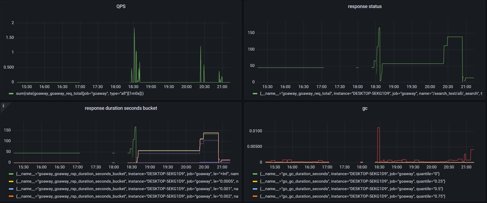

# goaway

Chinese segment,dictionary manage, banned words filtering, Chinese to pinyin

### Features

- chinese segment
- traditional chinese to simplified chinese
- elasticSearch proxy middleware
- banned words filtering
- chinese to pinyin
- jsonrpc
- manage ui
- monitor with grafana
- log collect with loki

### UI


### Monitor



### Log


### TODO

#### 2.0

- [ ] new word discovery
- [ ] grpc
- [ ] distributed Services

#### docker

- container start：

```shell
docker-compose up -d
```

- rolling start:

```shell
docker-compose pull && docker-compose up -d
```