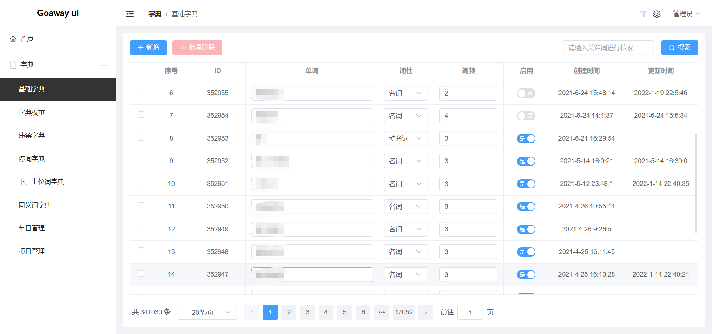
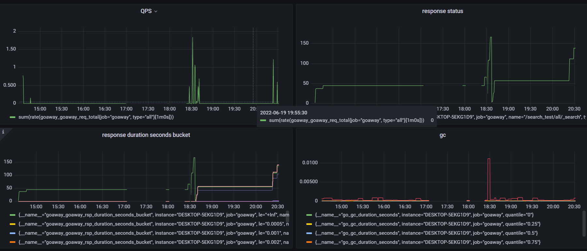
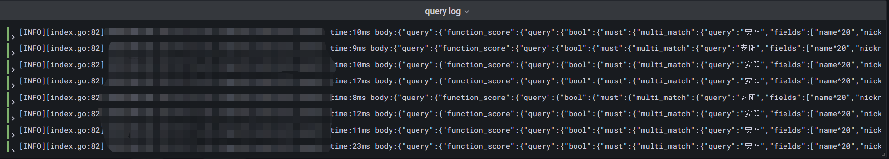

# goaway

中文分词、违禁词过滤、汉字转拼音

### 特性

- 中文分词
- 繁简转换
- ElasticSearch 中间件
- 违禁词
- 汉字转拼音
- jsonrpc
- 管理ui
- 监控（grafana）
- 日志收集（loki）

### UI



### 监控



### 日志



### TODO

#### 2.0

- [ ] 新词发现
- [ ] grpc
- [ ] 分布式

#### docker

- 启动容器：

```shell
docker-compose up -d
```

- 滚动启动:

```shell
docker-compose pull && docker-compose up -d
```